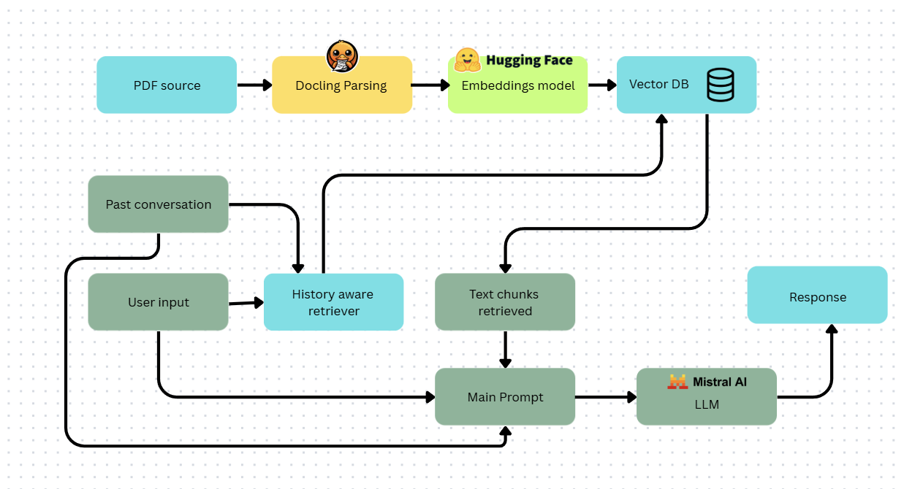

# RAG Chatbot - Simple Retrieval-Augmented Generation Demo

A minimal implementation of a Retrieval-Augmented Generation (RAG) chatbot that demonstrates how RAG systems work by combining document retrieval with large language model generation. For this application we are using one pdf file as a source file for storing embeddings and retireve later (2408.09869v5.pdf). You can download it or go to https://arxiv.org/pdf/2408.09869. For LLM, a simple and fast is choosen which is model: mistral-small-latest and embeddings model is from huggingFace : sentence-transformers/all-mpnet-base-v2. The reason behind that is because of the free tier. The purpose is only to demonstate on how simple RAG works.

## 🎯 Purpose

This project serves as a aimple showcase of RAG (Retrieval-Augmented Generation) technology, demonstrating how to:
- Extract documents and create embeddings from the extracted chunks.
- Store embeddings in a vector database
- Retrieve relevant context based on user queries/question
- Generate informed responses using retrieved context

## 🏗️ Architecture

```

```

The system follows the classic RAG pipeline:
1. **Document Processing**: PDF content is processed using Docling with langchain tools
2. **Embedding Creation**: Text chunks are converted to vector embeddings using embeddings model from huggingFace
3. **Vector Storage**: Embeddings are stored in ChromaDB
4. **Query Processing**: Raw user questions that being summarized in one sentence to make it aware of past conversation too (history aware sentence) is embedded and matched against stored vectors
5. **Context Retrieval**: Relevant document chunks are retrieved based on the summary of user question with past conversation (history aware sentence)
6. **Response Generation**: LLM generates answers using prompt with input : past conversation, retrived chunks, raw user input

**History aware sentence example**
Past
A: I love yakiniku, please suggest me good restaurant.
B: Of course, you can go to ABC restaurant.
Current
A: What is the price range there?
history aware sentence: What is price range for yakiniku at ABC restaurant?

## 🔧 Tech Stack

- **Document Processing**: Docling (for PDF parsing and content extraction)
- **Vector Database**: ChromaDB (for embedding storage and similarity search)
- **Embeddings**: sentence-transformers/all-mpnet-base-v2
- **LLM**: mistral-small-latest
- **Others**: Streamlit

## 📁 Project Structure

```
RAG_APPLICATION/
├── create_embeddings.py    # PDF processing with Docling and create embeddings in persistant disk (chroma_db)
│── RAG_streamlit.py           # main app
├── RAG_utils.py         # Function for RAG operations
├── 2408.09869v5.pdf       # Source document (Docling documentation)
├── requirements.txt            # Python dependencies
└── README.md                   # This file
```

## 🚀 Getting Started

### Prerequisites

- Python 3.8+
- pip or conda for package management

### Installation

1. **Clone the repository**
   ```bash
   git clone https://github.com/najmi-hisham/RAG_APPLICATION.git
   cd RAG_APPLICATION
   ```

2. **Install dependencies**
   ```bash
   pip install -r requirements.txt
   ```

3. **Set up environment variables**
   ```bash
   cp .env.example .env
   # Edit .env with your API keys and configuration
   For this project im using mistral API key for LLM usage
   ```

### Usage

1. **Create Vector Database in local using create_embeddings.ipynb file step by step**
   This will:
   - Process the Docling documentation PDF
   - Generate embeddings for document chunks
   - Store embeddings in ChromaDB

2. **Start the chatbot**
   ```bash
   streamlit run RAG_application.py
   ```

3. **Ask questions about Docling in the chatbot input text box**
   ```
   > What is Docling?
   > What is the difference between Docling and other parsing tools?
   > What file formats does Docling support?
   ```

## 🔍 How RAG Works (Demo Flow)

This implementation demonstrates the core RAG concepts:

1. **Document Ingestion**: The Docling documentation PDF is processed and split into meaningful chunks
2. **Vectorization**: Each chunk is converted to a high-dimensional vector representation
3. **Storage**: Vectors are stored in ChromaDB with metadata for efficient retrieval
4. **Query Processing**: When you ask a question, it's also converted to a vector to check the relevant documents from embeddings vector database
5. **Similarity Search**: The system finds the most relevant document chunks
6. **Context Assembly**: Retrieved chunks are combined to form context
7. **Generation**: The LLM generates a response using both your question and the retrieved context

## 🎯 Key Features

- **Simple Setup**: Single PDF source for easy understanding
- **Educational**: Clear demonstration of RAG principles
- **Extensible**: Easy to modify for different documents or use cases
- **Local Storage**: Uses ChromaDB for local vector storage
- **Contextual Responses**: Answers are grounded in the source document

## 🔄 Limitations & Future Improvements

**Current Limitations:**
- Single document source (by design for simplicity)
- Basic chunking strategy
- smamll LLM and embeddings model

**Potential Enhancements:**
- Multi-document support
- Conversational context
- Advanced chunking strategies
- Hybrid search (semantic + keyword)
- Response citations

## 🤝 Contributing

This is an educational project. Feel free to:
- Fork and experiment with different configurations
- Try different embedding models
- Implement additional features
- Share your learnings!
- You can try : https://ragapplication-metr4aezlt3uuhcazw7nxt.streamlit.app/


## 🙏 Acknowledgments

- [Docling](https://github.com/DS4SD/docling) for document processing
- [ChromaDB](https://www.trychroma.com/) for vector storage
- The RAG research community for pioneering this approach

---

**Note**: This project is designed for educational purposes to demonstrate RAG concepts. For production use, consider additional features like error handling, monitoring, and security measures.
